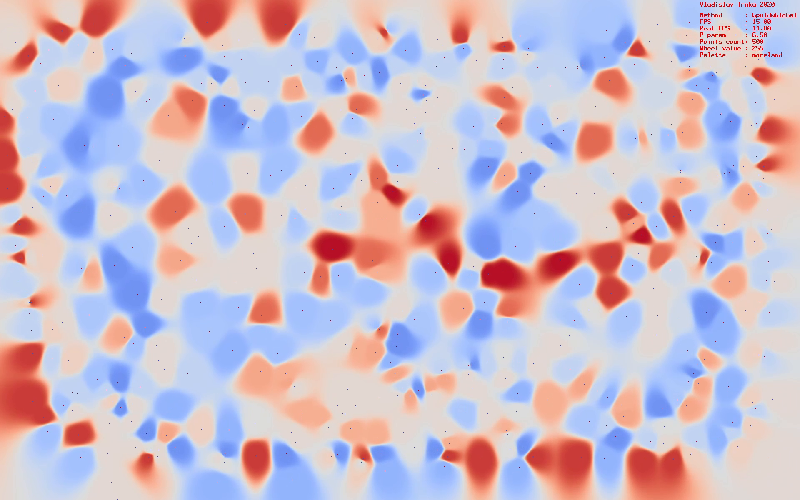
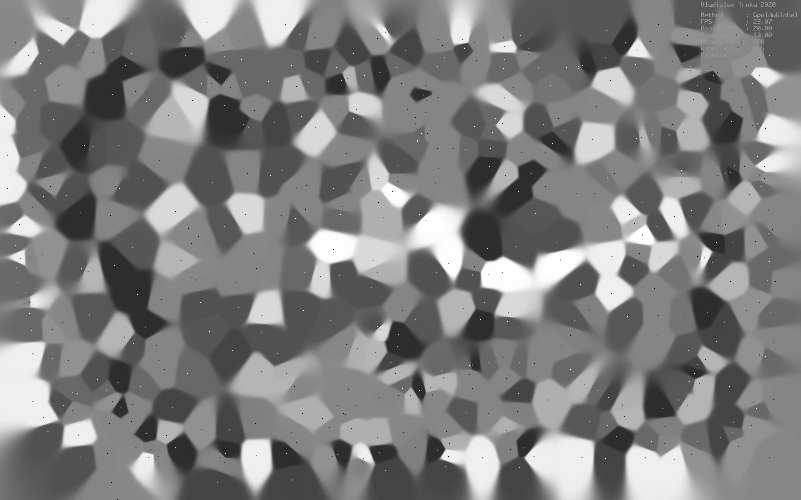

# IDW on CUDA

Visualize IDW using blazingly fast CUDA operations. 

Semestral work for General-purpose computing on graphics processing units course on CTU FEE in Prague, Czech

## Getting Started

Just head to build folder and run any example. 
Be aware that CUDA should be installed on your machine!

Click on screen to add points, left click to remove them. Tab to change method. If ou want more actions, then press key *h* and see all possible actions.

## Screenshots

